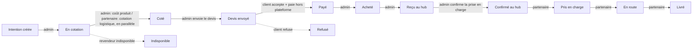

# Kaya — User Flows

Kaya moves a purchase through three participants who never see the same screen:

- **[Opérateur (Super Admin)](./admin-flow.md)** — based at a hub, sees every price and margin, drives the order from a bare product link to a paid, shipped parcel.
- **[Partenaire logistique](./partner-flow.md)** — quotes and ships. Sees exactly enough to do that (product, quantity, route) and never the product cost, platform fee, or customer total.
- **[Client](./customer-flow.md)** — no account. Everything happens over a phone number, an email address, and one unguessable link.

## How one order crosses all three

The two moments control crosses from one side to another — the quote going out to the customer, and the confirmed parcel handed to the partner — are where the [price-visibility rule](#the-one-hard-rule) matters most.

## The one hard rule

The partner never sees `productCost`, `platformFee`, or the customer's total. The customer never sees the cost/fee split behind their total. Both are enforced in the API's response shape (the fields are omitted from the serialization entirely), not by hiding elements in the interface.

## Reading these docs

Each flow doc is a numbered walkthrough of what that participant actually does, screen by screen — the route it happens on, the button they click (in the product's own French copy), and the status change that results. They describe the app as built, not an aspirational spec: if a button label or route changes, update the doc in the same PR.
